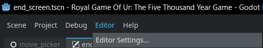
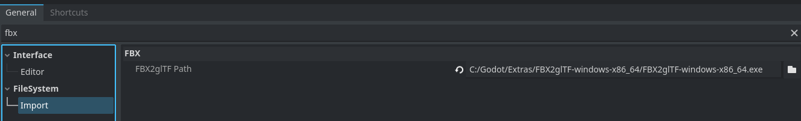

# RoyalGameOfUr
Godot version: 4.2.2

**Opening the project** 
1. Clone the repository.
2. Open the project in godot, by importing the project.godot file inside of the repository.
   
For some of the scenes in the project, The FBX Importer plugin is **required** to open it.  
1. Download the plugin: https://godotengine.org/fbx-import/
2. Open any project in Godot.
3. Open the Editor Settings. 
    
4. Navigate to **Filesystem > Import**.
5. Link the path of the downloaded plugin.
    
      

**Necessary End Screen Updates:**
1. Open end_screen.tscn (scenes/ui/end_screen.tscn) 
    
      
2. Select the EndScreen node. Here you can change the Survey Link variable.
    
      
3. Select the TextLabel node inside of SurveyMenu. Here you can change the text displayed in the endscreen.
    
      

**To link the session id to the survey:**
1. Open end_screen.gd (scripts/ui/end_screen.gd)
2. Navigate to the bottom of the _on_game_ended function.
    
3. Make sure the survey_button.url is set to a link with the session id included, for example: survey_link + GameDataCollector.current_game_data.uuid. This format can vary depending on the format you wish the link to be.   

**Getting familiar with the project**  
If you want to add new features to this game. It might be useful to get a better understanding of how the core of the boardgame is implemented.   
