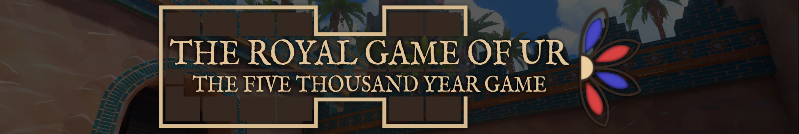

# Royal Game of Ur

> [!IMPORTANT]
> This repository is not actively maintained, and there are no development plans for the foreseeable future.

*The Royal Game of Ur: The Five Thousand Year Game* is a digital immersive experience about the historical board game played in ancient Mesopotamia, developed by *Team Llamassu*. It's a two-player turn-based strategy race game, with elements of both luck and strategy, where the players roll a set of dice to be able to move their pieces across the board to the finish line.
This game was played by royals and commoners alike, for a period lasting over 2000 years, with the first finding of the game dating back to 2600 B.C.

This project was developed in collaboration with *Leiden University*, and aims to be used as a tool for future research, besides entertainment.

## Game System Specifications

- *OS:* Windows or Linux (other platforms require building the game yourself)
- *Minimum disk space:* 2 GB
- *Input Devices:* Mouse and Keyboard

## Game installation

This game does not have an installer (might be added later), and is distributed in a ZIP package. To install and run the game using the ZIP package, just download and extract wherever you would like, and run the executable.

The latest version can be downloaded through the *[Releases](https://github.com/zemiguel20/RoyalGameOfUr/releases)* page. (TODO)

## Documentation

The documentation can be found in the `docs` folder of this repository (documentation [HOME](docs/HOME.md)).
