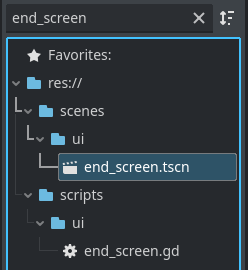
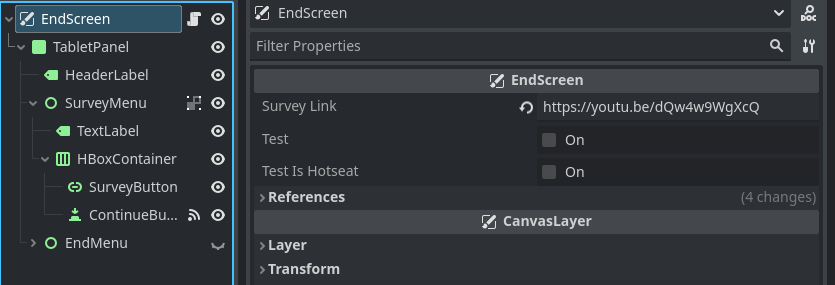
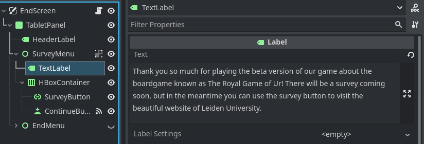
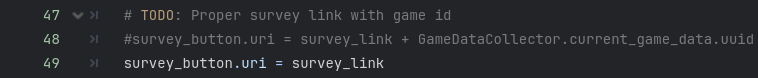

# Royal Game of Ur

	

(Add nice project description here!)

## Game System Specifications

- *OS:* Windows or Linux (other platforms require building the game yourself)
- *Minimum disk space:* 2 GB
- *Input Devices:* Mouse and Keyboard

## Game installation

This game does not have an installer (might be added later), and is distributed in a ZIP package. To install and run the game using the ZIP package, just download and extract wherever you would like, and run the executable.

The lastest version can be downloaded through:
- Itch.io (TODO: add link or banner to game page)
- This repository *[Releases](https://github.com/zemiguel20/RoyalGameOfUr/releases)* page.

## Project setup

This project uses Godot 4.2 . C# support is not required, but using the .NET version of the engine will still work just as fine.

The project contains models in FBX format, and thus the Godot Engine's FBX2glTF importer is needed.
The engine should automatically prompt to install and configure the importer, but if not, then go to `Editor -> Configure FBX Importer...`, which manually opens the corresponding  window.

## Other

**Necessary End Screen Updates:**
1. Open end_screen.tscn (scenes/ui/end_screen.tscn) 
    
      
2. Select the EndScreen node. Here you can change the Survey Link variable.
    
      
3. Select the TextLabel node inside of SurveyMenu. Here you can change the text displayed in the endscreen.
    
      

**To link the session id to the survey:**
1. Open end_screen.gd (scripts/ui/end_screen.gd)
2. Navigate to the bottom of the _on_game_ended function.
    
3. Make sure the survey_button.url is set to a link with the session id included, for example: survey_link + GameDataCollector.current_game_data.uuid. This format can vary depending on the format you wish the link to be.   

**Getting familiar with the project**  
If you want to add new features to this game. It might be useful to get a better understanding of how the core of the boardgame is implemented.   
